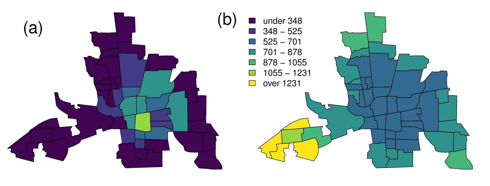
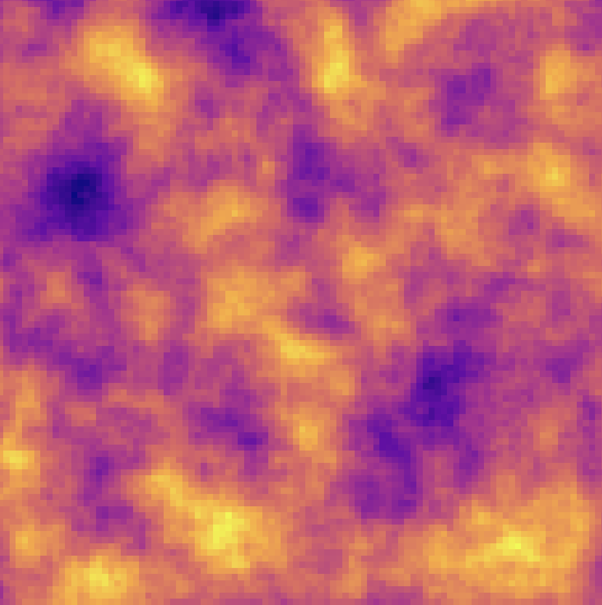

<!-- Build with: xaringan::inf_mr() -->

```{r preamble, include=FALSE, cache=FALSE}
source(here::here("dfo-tesa-2025/preamble.R"))
do.call(knitr::opts_chunk$set, knitr_opts)
```

```{r libs, include=FALSE}
library(dplyr)
library(ggplot2)
library(mgcv)
library(sdmTMB)
```

# Who we are


---

# Plan for the 3-day course

* Day 1: Intro to random fields, intro to sdmTMB, spatial models

* Day 2: Spatiotemporal models, time-varying effects, spatially varying effects, index standardization

* Day 3: Extrapolation and forecasting, data integration, other advanced topics

---

# Course rhythm

* Each day: about 1–1:15 hours of lectures, 5 minute break, ~50 minutes of exercises, ~15 minute regroup

* Have questions? Use the [Google Doc](https://docs.google.com/document/d/1JScvWtNWrJUfMrUvDZMzWhTUXqsLZSyiN2ULZdaihZk/edit?usp=sharing), ask during any pause, or at the end of each day. Thanks!

---

# Types of spatial data

### Areal / lattice data

```{r spatial-areal, echo=FALSE, out.width="80%"}

```

.tiny[
Ver Hoef, J.M., Hanks, E.M., and Hooten, M.B. 2018. Spatial Statistics 25: 68–85. doi:10.1016/j.spasta.2018.04.006.
]

---

# Types of spatial data

### Point process data

```{r spatial-pp, echo=FALSE, out.width="25%"}
knitr::include_graphics("images/point-process.jpeg")
```

.tiny[
Renner, I.W. et al. 2015. Methods Ecol Evol 6(4): 366–379. doi:10.1111/2041-210X.12352.
]

---

# Types of spatial data

### Geostatistical data

Observations of a continuous spatial process at chosen sample locations.

```{r spatial-geostat, echo=FALSE, out.width="55%"}
knitr::include_graphics("images/survey-maps.png")
```

.tiny[
We'll focus on geostatistical models today.
]

---

# Motivating questions

* Data often have spatial attributes

* Ideal world:
  * Plug spatial covariates into a GLM / GLMM
  * Residuals are uncorrelated

```{r sim-rf-intro, echo=FALSE, fig.asp=0.4}
set.seed(123)
predictor_dat <- data.frame(
  X = runif(300), Y = runif(300),
  year = 1
)
mesh <- make_mesh(predictor_dat,
  xy_cols = c("X", "Y"),
  cutoff = 0.1
)
sim_dat <- sdmTMB_simulate(
  formula = ~1,
  data = predictor_dat,
  time = "year",
  mesh = mesh,
  family = gaussian(link = "identity"),
  range = 0.00001,
  sigma_E = 0.1,
  phi = 0.01,
  sigma_O = 0.2,
  seed = 3542,
  B = c(0)
)

ggplot(sim_dat, aes(X, Y, col = observed)) +
  geom_point(alpha = 0.7, size = 3) +
  guides(col = guide_legend(title = "Residuals")) +
  scale_color_gradient2()
```

---

# Reality

Residual spatial autocorrelation is pervasive in geostatistical data.

Alternatively, there are unmodelled, missing, or "latent" spatially structured variables.

```{r sim-rf-intro-cor, echo=FALSE, fig.asp=0.4}
set.seed(123)
predictor_dat <- data.frame(
  X = runif(300), Y = runif(300),
  year = 1
)
mesh <- make_mesh(predictor_dat,
  xy_cols = c("X", "Y"),
  cutoff = 0.1
)
sim_dat <- sdmTMB_simulate(
  formula = ~1,
  data = predictor_dat,
  time = "year",
  mesh = mesh,
  family = gaussian(link = "identity"),
  range = 0.25,
  sigma_E = 0.1,
  phi = 0.01,
  sigma_O = 0.1,
  seed = 3542,
  B = c(0)
)
ggplot(sim_dat, aes(X, Y, col = observed)) +
  geom_point(alpha = 0.7, size = 3) +
  guides(col = guide_legend(title = "Residuals")) +
  scale_color_gradient2()
```

---

# Why focus on Gaussian random fields?

Random fields are attractive because they:

1. Flexibly capture a wide range of spatial patterns
2. Are computationally efficient with modern approximations
3. Provide interpretable parameters (variance, range)

```{r rf-eg, echo=FALSE, out.width="32%"}

```

---

# Modeling latent spatial variables

* Need a "wiggly" surface to approximate unobserved spatially structured covariates
* Options include:
  * 2D smoothers with GAMs (e.g., `mgcv`)
  * Gaussian random fields
  * Other machine-learning approaches (e.g., random forests)

.tiny[
Miller, D.L., Glennie, R., and Seaton, A.E. 2019. JABES.  
Stock, B.C. et al. 2019. Can. J. Fish. Aquat. Sci.
]

---

# Covariance and correlation functions

* Constrain the multivariate normal distribution defining the random field
* Specify how correlation decays with distance
* Can be isotropic or anisotropic
* Common choices: exponential, Gaussian (squared exponential), Matérn

We'll build intuition with the exponential and Gaussian forms before generalizing to Matérn.

---

# Exponential correlation

$$
\mathcal{C}(d) = e^{-d / \rho}
$$

* $d$ is distance
* $\rho$ controls how quickly correlation decays

```{r exp-cov, fig.asp=0.45}
exp_cor <- function(d, rho = 0.2) exp(-d / rho)
d <- data.frame(x = seq(0, 1, length.out = 300))
d1 <- data.frame(x = d$x, y = exp_cor(d$x, rho = 0.2), rho = 0.2)
d2 <- data.frame(x = d$x, y = exp_cor(d$x, rho = 0.1), rho = 0.1)
d3 <- data.frame(x = d$x, y = exp_cor(d$x, rho = 0.4), rho = 0.4)

dplyr::bind_rows(d1, d2, d3) |>
  ggplot(aes(x, y, colour = as.factor(rho), group = rho)) +
  geom_line() +
  labs(y = "Correlation", x = "Distance", colour = expression(rho)) +
  coord_cartesian(expand = FALSE)
```

---

# Gaussian (squared exponential) correlation

$$
\mathcal{C}(d) = e^{-(d / \rho)^2}
$$

* Still governed by distance $d$ and rate parameter $\rho$
* Decays faster than the exponential as distance increases

```{r gauss-cov, fig.asp=0.45}
gaus_cor <- function(d, rho = 0.2) exp(-(d / rho)^2)
d <- data.frame(x = seq(0, 1, length.out = 300))
d1 <- data.frame(x = d$x, y = gaus_cor(d$x, rho = 0.2), rho = 0.2)
d2 <- data.frame(x = d$x, y = gaus_cor(d$x, rho = 0.1), rho = 0.1)
d3 <- data.frame(x = d$x, y = gaus_cor(d$x, rho = 0.4), rho = 0.4)

dplyr::bind_rows(d1, d2, d3) |>
  ggplot(aes(x, y, colour = as.factor(rho), group = rho)) +
  geom_line() +
  labs(y = "Correlation", x = "Distance", colour = expression(rho)) +
  coord_cartesian(expand = FALSE)
```

---

# Matérn covariance

$$
\mathcal{C}(d) = \frac{\sigma^2}{2^{\nu - 1}\Gamma(\nu)} (\kappa d)^\nu K_\nu (\kappa d)
$$

* $d$ = distance
* $\Gamma$ = gamma function
* $K_\nu$ = modified Bessel function of the 2nd kind
* $\kappa$ = decorrelation rate
* $\sigma^2$ = variance
* $\nu$ controls smoothness (fixed at 1 for SPDE implementation)

```{r matern-plot, fig.asp=0.51, fig.width=3.8, out.width = "450px",}
x <- seq(from = 0, to = 1.5, length.out = 300)
df <- data.frame(
  x = rep(x, 4),
  nu = sort(rep(c(0.5, 1, 2, 10), 100))
)
df$row <- seq(1, nrow(df))
df <- dplyr::group_by(df, row) |> 
  dplyr::mutate(
    cov =
      rSPDE::matern.covariance(h = x, kappa = 5, nu = nu, sigma = 1)
  )
df$nu <- as.factor(df$nu)
ggplot(df, aes(x, cov, col = nu, group = nu)) +
  geom_line() +
  xlab("Distance") +
  ylab("Covariance") +
  # ggtitle("Matérn covariance") +
  guides(col = guide_legend(title = expression(nu))) +
  # theme(text = element_text(size = 21)) +
  coord_cartesian(expand = FALSE)
```

---

# Matérn range intuition

Range $\approx$ distance where correlation decays to 0.13.

If $\nu = 1$, $\mathrm{range} = \sqrt{8} / \kappa$.

```{r matern-range, message=FALSE, warning=FALSE, fig.asp=0.36}
if (requireNamespace("cowplot", quietly = TRUE) &&
    requireNamespace("RColorBrewer", quietly = TRUE)) {
  predictor_dat <- expand.grid(
    x = seq(0, 1, length.out = 100),
    y = seq(0, 1, length.out = 100),
    year = 1
  )
  sim_mesh <- make_mesh(predictor_dat, xy_cols = c("x", "y"), cutoff = 0.01)
  s1 <- sdmTMB_simulate(
    formula = ~1,
    data = predictor_dat,
    mesh = sim_mesh,
    range = 0.2,
    phi = 0.1,
    sigma_O = 0.2,
    seed = 1,
    B = 0
  )
  s2 <- sdmTMB_simulate(
    formula = ~1,
    data = predictor_dat,
    mesh = sim_mesh,
    range = 0.6,
    phi = 0.1,
    sigma_O = 0.2,
    seed = 1,
    B = 0
  )

  x <- seq(0, 1, length.out = 200)
  range_vals <- c(0.2, 0.6)
  df <- expand.grid(
    x = x,
    range = range_vals
  )
  matern_cor <- function(h, kappa, nu = 1, sigma = 1) {
    out <- (sigma^2 / (2^(nu - 1) * gamma(nu))) *
      ((kappa * abs(h))^nu) *
      besselK(kappa * abs(h), nu)
    out[h == 0] <- sigma^2
    out
  }
  df$cor <- matern_cor(df$x, kappa = sqrt(8) / df$range)

  g1 <- ggplot(s1, aes(x, y, fill = mu)) +
    geom_raster(show.legend = FALSE) +
    scale_fill_viridis_c(option = "C") +
    coord_cartesian(expand = FALSE) +
    theme_light() +
    labs(title = "(a) Range = 0.2", x = "X", y = "Y")

  g2 <- ggplot(s2, aes(x, y, fill = mu)) +
    geom_raster(show.legend = FALSE) +
    scale_fill_viridis_c(option = "C") +
    coord_cartesian(expand = FALSE) +
    theme_light() +
    labs(title = "(b) Range = 0.6", x = "X", y = "Y")

  g3 <- ggplot(df, aes(x, cor, colour = as.factor(range), group = range)) +
    geom_line(size = 1) +
    geom_hline(yintercept = 0.13, linetype = 2, colour = "grey50") +
    scale_colour_manual(values = RColorBrewer::brewer.pal(length(range_vals) + 1, "Blues")[-1]) +
    coord_cartesian(expand = FALSE, ylim = c(0, 1)) +
    theme_light() +
    labs(title = "(c) Matérn correlation function", x = "Distance", y = "Correlation", colour = "Range")

  cowplot::plot_grid(g1, g2, g3, ncol = 3)
} else {
  cat("Install the 'cowplot' and 'RColorBrewer' packages to reproduce the Matérn range figure.\n")
}
```

.tiny[
Lindgren, F., Rue, H., and Lindström, J. 2011. JRSS-B 73(4): 423–498.
]

---

# Predictive process models

* Estimate spatial field as random effects
* High-dimensional datasets can be computationally expensive
* Predictive process (knot-based) Gaussian process models:
  * Estimate the field at a subset of locations ("knots" / "vertices")
  * Use the covariance function to interpolate to observation locations

---

# Predictive process models

* More knots (vertical dashed lines) = more wiggliness & more parameters to estimate

```{r show-gp, fig.height=4}
x <- seq(1, 50)
d <- as.matrix(dist(x, diag = TRUE))
set.seed(123)
df <- data.frame(
  x = x,
  true = c(spam::rmvnorm(1, mu = 0, Sigma = 1 * exp(-0.05 * d)))
)
df$y <- rnorm(df$true, df$true, 0.1)

f1 <- mgcv::gam(y ~ s(x, k = 25, bs = "bs"), data = df)
knots1 <- data.frame("x" = f1$smooth[[1]]$knots, ymin = 0, ymax = 1.0e10)
g1 <- ggplot(df, aes(x, y)) +
  geom_vline(data = knots1, aes(xintercept = x), col = "grey20", size = 0.3, linetype = "dashed") +
  geom_point(col = "red", alpha = 0.7) +
  theme(panel.grid = element_blank()) +
  ylab("Observations") +
  geom_smooth(method = "gam", formula = y ~ s(x, bs = "bs", k = 25)) +
  coord_cartesian(xlim = c(0, 50))

f2 <- mgcv::gam(y ~ s(x, k = 7, bs = "bs"), data = df)
knots2 <- data.frame("x" = f2$smooth[[1]]$knots, ymin = 0, ymax = 1.0e10)
g2 <- ggplot(df, aes(x, y)) +
  geom_vline(data = knots2, aes(xintercept = x), col = "grey20", size = 0.3, linetype = "dashed") +
  geom_point(col = "red", alpha = 0.7) +
  theme(panel.grid = element_blank()) +
  ylab("Observations") +
  geom_smooth(method = "gam", formula = y ~ s(x, bs = "gp", k = 7)) +
  coord_cartesian(xlim = c(0, 50))
gridExtra::grid.arrange(g1, g2, ncol = 1)
```

---

# What is a random field?

```{r sim-rf-dat, message=FALSE, warning=FALSE}
predictor_dat <- expand.grid(
  x = seq(0, 1, length.out = 100),
  y = seq(0, 1, length.out = 100),
  year = seq_len(6)
)
mesh <- make_mesh(predictor_dat, xy_cols = c("x", "y"), cutoff = 0.05)
sim_dat <- sdmTMB_simulate(
  formula = ~1,
  data = predictor_dat,
  time = "year",
  mesh = mesh,
  family = gaussian(),
  range = 0.5,
  sigma_E = 0.2,
  phi = 0.1,
  sigma_O = NULL,
  seed = 1,
  B = 0
)
```

```{r random-field-demo}
ggplot(sim_dat, aes(x, y, fill = mu)) +
  facet_wrap(vars(year)) +
  geom_raster() +
  scale_fill_gradient2() +
  coord_fixed(expand = FALSE)
```

---
background-image: url("images/eagle.png")
background-position: bottom right
background-size: 35%

# Random field


---
background-image: url("images/beaker.png")
background-position: bottom right
background-size: 35%

# Random field

* A 2 dimensional "Gaussian Process"

--

* A realization from a multivariate normal distribution with some covariance function

---
background-image: url("images/elmo.png")
background-position: bottom right
background-size: 30%

# Random field

* A way of estimating a wiggly surface to account for spatial and/or spatiotemporal correlation in data

--

* Alternatively, a way of estimating a wiggly surface to account for latent or unobserved variables

--

* Provides useful covariance parameter estimates: spatial variance and a range where points are effectively uncorrelated

---

# Many ways to simulate random fields

* `RandomFields::RFsimulate()` simulates univariate / multivariate fields
* `fields::sim.rf()` simulates random fields on a grid
* `geoR::grf()` simulates random fields with irregular observations
* `glmmfields::sim_glmmfields()` simulates random fields with/without extreme values
* `sdmTMB::sdmTMB_simulate()` simulates univariate fields with `sdmTMB`

???
Homework: try a few of these functions to build your intuition about how covariance parameters influence smoothness.

---

# Effects of changing variance and range

```{r sim-rf-grid, echo=FALSE, fig.asp=0.7}
set.seed(123)
predictor_dat <- data.frame(
  X = runif(300), Y = runif(300),
  year = 1
)
mesh <- make_mesh(predictor_dat,
  xy_cols = c("X", "Y"),
  cutoff = 0.1
)

grid_pars <- expand.grid(range = c(0.1, 0.5), sigma_O = c(0.05, 0.1))

sim_list <- vector("list", nrow(grid_pars))
for (i in seq_len(nrow(grid_pars))) {
  s <- sdmTMB_simulate(
    formula = ~1,
    data = predictor_dat,
    time = "year",
    mesh = mesh,
    family = gaussian(link = "identity"),
    range = grid_pars$range[i],
    sigma_E = NULL,
    phi = 0.01,
    sigma_O = grid_pars$sigma_O[i],
    seed = 3542,
    B = c(0)
  )
  s$range <- grid_pars$range[i]
  s$sigma_O <- grid_pars$sigma_O[i]
  sim_list[[i]] <- s
}

sim_dat <- dplyr::bind_rows(sim_list)

sim_dat$sigma_O <- paste0("sigma_O = ", sim_dat$sigma_O)
sim_dat$range <- paste0("range = ", sim_dat$range)
ggplot(sim_dat, aes(X, Y, col = observed)) +
  geom_point(size = 1) +
  scale_color_gradient2() +
  facet_wrap(range ~ sigma_O)
```

---

# Effects of adding noise

* Large observation error looks like noise
* $\sigma_{obs} \gg \sigma_{O}, \sigma_{E}$

```{r sim-rf-large_phi, echo=FALSE, fig.asp=0.5}
set.seed(123)
predictor_dat <- data.frame(
  X = runif(300), Y = runif(300),
  year = 1
)
mesh <- make_mesh(predictor_dat,
  xy_cols = c("X", "Y"),
  cutoff = 0.1
)

sim_dat <- sdmTMB_simulate(
  formula = ~1,
  data = predictor_dat,
  time = "year",
  mesh = mesh,
  family = gaussian(link = "identity"),
  range = 0.5,
  sigma_E = 0.1,
  phi = 1.0,
  sigma_O = 0.1,
  seed = 3542,
  B = c(0.2)
)

ggplot(sim_dat, aes(X, Y, col = observed)) +
  geom_point(alpha = 0.7, size = 3) +
  scale_color_gradient2()
```

---

# Moderate observation errors

* $\sigma_{obs} = \sigma_{O} = \sigma_{E}$

```{r sim-rf-med_phi, echo = FALSE, fig.asp=0.5}
sim_dat <- sdmTMB_simulate(
  formula = ~1,
  data = predictor_dat,
  time = "year",
  mesh = mesh,
  family = gaussian(link = "identity"),
  range = 0.5,
  sigma_E = 0.1,
  phi = 0.1,
  sigma_O = 0.1,
  seed = 3542,
  B = 0.2
)

ggplot(sim_dat, aes(X, Y, col = observed)) +
  geom_point(alpha = 0.7, size = 3) +
  scale_color_gradient2()
```

---

# Small observation errors

* $\sigma_{obs} \ll \sigma_{O}, \sigma_{E}$

```{r sim-rf-small_phi, echo = FALSE, fig.asp=0.5}
sim_dat <- sdmTMB_simulate(
  formula = ~1,
  data = predictor_dat,
  time = "year",
  mesh = mesh,
  family = gaussian(),
  range = 0.5,
  sigma_E = 0.1,
  phi = 0.01,
  sigma_O = 0.1,
  seed = 3542,
  B = 0.2
)

ggplot(sim_dat, aes(X, Y, col = observed)) +
  geom_point(alpha = 0.7, size = 3) +
  scale_color_gradient2()
```

---

# Estimating random fields

.small[
* Georeferenced datasets often have thousands of points
* As in 1D smoothing, we need an efficient approximation
  * Options include predictive processes, covariance tapering, nearest-neighbour approaches
* `sdmTMB` uses an SPDE-based approach derived from INLA
  * Same machinery underlies VAST
  * INLA resources: <https://www.r-inla.org/learnmore/books>
]

---

# SPDE approach: what you need to know

.small[
1. Build a mesh covering the region of interest  
2. Use the mesh to construct sparse matrices that define a Gaussian Markov random field (GMRF)  
3. Estimate $\kappa$ (controls range) and $\tau$ (controls variance) to characterize the Matérn covariance  
4. Interpolate between mesh vertices and observation locations using a projection matrix
]

---

# SPDE precision matrix

With the SPDE formulation the GMRF precision matrix is

$$
\mathbf{Q} = \tau^2 \left( \kappa^4 \mathbf{C}_0 + 2 \kappa^2 \mathbf{G}_1 + \mathbf{G}_2 \right)
$$

* $\mathbf{C}_0$, $\mathbf{G}_1$, $\mathbf{G}_2$ come from the mesh geometry
* $\tau$ is inversely related to marginal variance ($\sigma^2 = [4 \pi \tau^2 \kappa^2]^{-1}$ when $\nu = 1$)
* $\kappa$ controls the spatial range ($\mathrm{range} = \sqrt{8}/\kappa$)

---

# Introducing meshes

Implementing the SPDE requires constructing a mesh.

```{r mesh-example, fig.width=6.5}
mesh <- make_mesh(pcod, xy_cols = c("X", "Y"), cutoff = 10)
ggplot() +
  inlabru::gg(mesh$mesh) +
  geom_point(data = pcod, aes(x = X, y = Y), alpha = 0.1, pch = 20) +
  coord_equal()
```

---

# Mesh construction tips

.small[
* A unique mesh is generally created for each dataset
* More triangles = more computation time *and* finer-scale predictions
* Coarser outer boundaries help limit triangle counts
* Use `cutoff` to avoid overly fine meshes
* Aim for fewer mesh vertices than data points
* Triangle edges should be shorter than the spatial range
* Great resource: ["How to make a bad mesh?"](https://haakonbakkagit.github.io/btopic114.html)
]

---

# Inspecting SPDE components

```{r fem-components, echo=FALSE}
if (requireNamespace("fmesher", quietly = TRUE)) {
  loc <- as.matrix(pcod[, c("X", "Y")])
  mesh_spde <- fmesher::fm_mesh_2d(loc = loc, cutoff = 10)
  spde <- fmesher::fm_fem(mesh_spde)
  str(names(spde))
} else {
  cat("Install the 'fmesher' package to inspect SPDE finite element matrices.\n")
}
```

.tiny[
These sparse matrices populate $(\mathbf{C}_0, \mathbf{G}_1, \mathbf{G}_2)$ in the precision matrix expression.
]

---

# From mesh to observations

.small[
We project random effects from mesh vertices to data locations with an interpolation (projection) matrix $\mathbf{A}$.
]

```{r A-matrix, echo=FALSE}
if (requireNamespace("fmesher", quietly = TRUE)) {
  loc <- as.matrix(pcod[, c("X", "Y")])
  mesh_spde <- fmesher::fm_mesh_2d(loc = loc, cutoff = 10)
  A <- fmesher::fm_basis(mesh_spde, loc = loc)
  cat("Rows (observations):", nrow(A), "\n")
  cat("Columns (mesh vertices):", ncol(A), "\n")
} else {
  cat("Install the 'fmesher' package to build projection matrices with `fm_basis()`.\n")
}
```

---

# Putting it all together

.small[
**Before fitting**
1. Create a mesh  
2. Calculate SPDE matrices  
3. Construct interpolation matrices
]

--

.small[
**Within the model**
1. Build the precision matrix $\mathbf{Q}$ from $\kappa$, $\tau$, and the SPDE matrices  
2. Evaluate the GMRF likelihood  
3. Project random effects to the data locations  
4. Add covariate effects and observation models  
5. Project to prediction locations as needed  
6. Convert $\kappa$, $\tau$ to interpretable range and variance
]

---

# Building your own mesh

* `INLA::inla.mesh.2d()` provides flexible mesh construction
* `INLA::meshbuilder()` (Shiny) helps interactively and returns R code
* Meshes can incorporate barriers / coastlines with shapefiles
* `sdmTMB::make_mesh()` offers a quick mesh builder for many problems

---

# Example: cutoff = 50 km

```{r mesh-example4, fig.width=6.5}
mesh <- make_mesh(pcod, xy_cols = c("X", "Y"), cutoff = 50)
ggplot() +
  inlabru::gg(mesh$mesh) +
  geom_point(data = pcod, aes(x = X, y = Y), alpha = 0.1, pch = 20) +
  coord_equal()
```

---

# Example: cutoff = 25 km

```{r mesh-example3, fig.width=6.5}
mesh <- make_mesh(pcod, xy_cols = c("X", "Y"), cutoff = 25)
ggplot() +
  inlabru::gg(mesh$mesh) +
  geom_point(data = pcod, aes(x = X, y = Y), alpha = 0.1, pch = 20) +
  coord_equal()
```

---

# Example: cutoff = 10 km

```{r mesh-example2, fig.width=6.5}
mesh <- make_mesh(pcod, xy_cols = c("X", "Y"), cutoff = 10)
ggplot() +
  inlabru::gg(mesh$mesh) +
  geom_point(data = pcod, aes(x = X, y = Y), alpha = 0.1, pch = 20) +
  coord_equal()
```

---

class: center, middle, inverse

# Exercises and code walkthroughs follow in the practical sessions.
