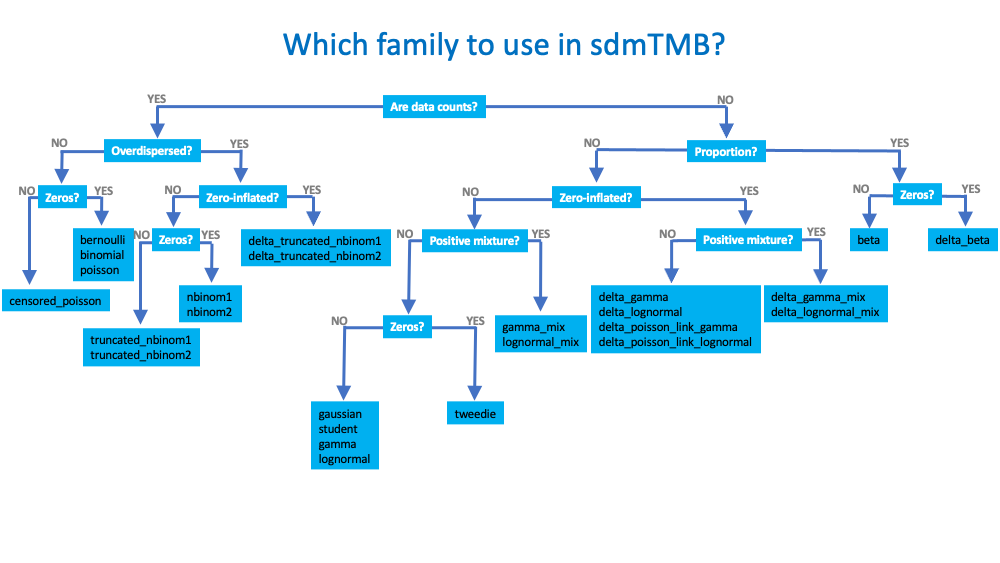
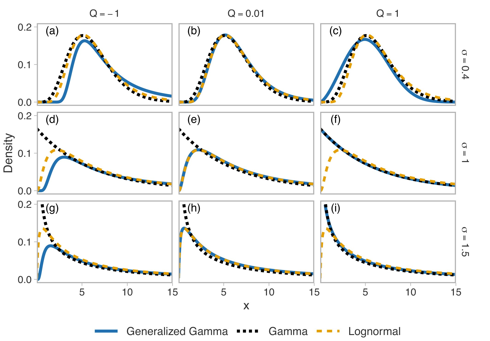
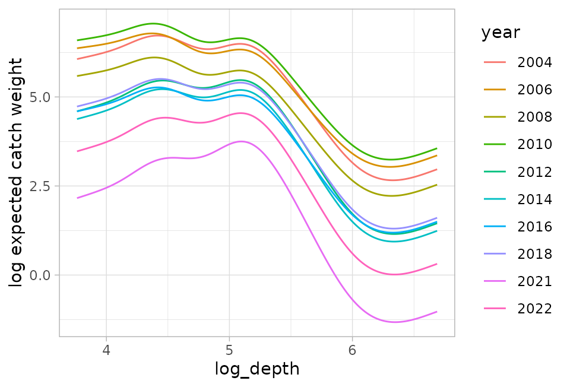
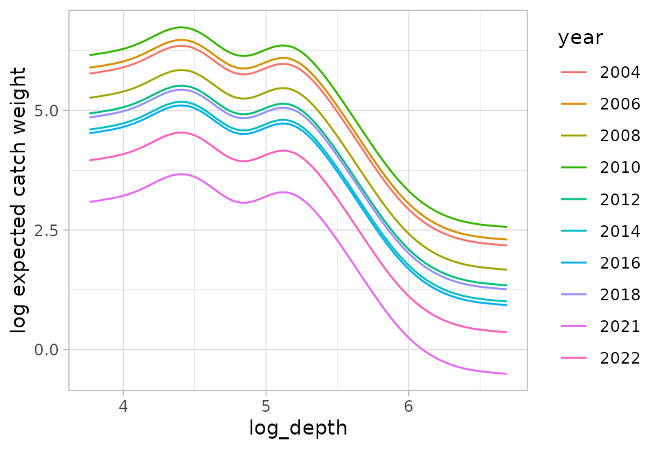

<!-- Build with: xaringan::inf_mr() -->

```{r preamble, include=FALSE, cache=FALSE}
source(here::here("dfo-tesa-2025/preamble.R"))
do.call(knitr::opts_chunk$set, knitr_opts)
```

```{r libs, include=FALSE}
library(dplyr)
library(sdmTMB)
library(ggplot2)
library(sf)
```

# Families

Many of the same families used in `glm()`, `glmmTMB()`, `mgcv::gam()` can be used here

Includes:
  `gaussian()`, `Gamma()`, 
  `binomial()`, `poisson()`, `Beta()`, 
  `student()`, `tweedie()`, 
  `nbinom1()`, `nbinom2()`,
  `truncated_nbinom1()`, `truncated_nbinom2()`,
  `delta_gamma()`, `delta_lognormal()`, `delta_beta()`, and more...
  
All have `link` arguments
  
See `?sdmTMB::Families`

---
<!-- These are exported dimensions from Powerpoint * 80% -->
.center[

 
*New distributions continue to be added  

]

---

# Tweedie distribution

.small[
Useful for positive continuous data with zeros (e.g., biomass density per unit effort) 

Dispersion ( $\phi$ ) and power ( $p$ ) parameters allow for a wide variety of shapes including many zeros

Also known as compound Poisson-Gamma distribution
]

```{r sim-tweedie, fig.width=4, out.width='400px'}
set.seed(123)
r1 <- fishMod::rTweedie(20000, mu = 3, phi = 0.1, p = 1.3)
r2 <- fishMod::rTweedie(20000, mu = 3, phi = 1.5, p = 1.3)
df <- data.frame(y = c(r1, r2), phi = sort(rep(c("0.1", "1.5"), length(r1))))
df$phi <- paste("Dispersion (phi) =", df$phi)
ggplot(df, aes(y)) +
  geom_histogram(bins = 200) +
  ylab("Density") +
  facet_wrap(~phi, ncol = 1, scale = "free_y") +
  coord_cartesian(xlim = c(0, 20))
```

---

# Generalized gamma distribution

.small[
Useful for positive continuous data

Can match the gamma or approach the lognormal

Can also be lighter tailed than the gamma, in between, or heavier tailed than the lognormal

All for one extra paramater, "Q"
]

.tiny[
Dunic, J.C., Conner, J., Anderson, S.C., and Thorson, J.T. 2025. The generalized gamma is a flexible distribution that outperforms alternatives when modelling catch rate data. ICES Journal of Marine Science 82(4): fsaf040. <https://doi.org/10.1093/icesjms/fsaf040>
]

---

# Generalized gamma distribution

.center[

]

.tiny[
Dunic, J.C., Conner, J., Anderson, S.C., and Thorson, J.T. 2025. The generalized gamma is a flexible distribution that outperforms alternatives when modelling catch rate data. ICES Journal of Marine Science 82(4): fsaf040. <https://doi.org/10.1093/icesjms/fsaf040>
]

---

# Standard delta models

Also known as "hurdle" models

* Delta/hurdle model has 2 sub-components ("linear predictors"):
  - presence/absence  
  - positive model

* many delta- families implemented: `delta_gamma()`, `delta_lognormal()`, `delta_gengamma()` etc  

---

# Poisson-link delta models

Addresses several shortcomings of standard delta models:
  - Linear predictors are additive
  - Can be used to combine weight, count, and encounter data

Often just fits the data better

E.g., `delta_gamma(type = "poisson-link")`

.small[
Vignette:<br>
<https://pbs-assess.github.io/sdmTMB/articles/poisson-link.html>
]

---

# Poisson-link delta models

Linear predictors represent:
  - log numbers density
  - log weight per "group"

Before entering the likelihood, these get transformed internally as:
  - probability of encounter
  - positive catch rate given encounter

---

# Poisson-link delta models

What do we mean by linear predictors?

$$
\begin{aligned}
\log (n) &= \boldsymbol{X_1} \boldsymbol{\beta_1} + \ldots,\\
\log (w) &= \boldsymbol{X_2} \boldsymbol{\beta_2} + \ldots,
\end{aligned}
$$
  
- $n$ represents group **n**umbers density
- $w$ represents **w**eight per group

---

## What do we mean by *linear predictors are additive*

Standard delta model:

.center[

]

---

## What do we mean by *linear predictors are additive*

Poisson link delta model:

.center[

]

---

# Poisson-link delta models

From linear predictors to data likelihood:

$$
\begin{aligned}
p &= 1 - \exp(-n),\\
r &= \frac{n w}{p},
\end{aligned}
$$
  
- $p$ represents encounter **p**robability
- $n$ represents group **n**umbers density
- $r$ represents positive catch **r**ate (i.e., catch rate given encounter)
- $w$ represents **w**eight per group.

---

# sdmTMB delta model arguments

Some arguments can be a list:

```{r argdemo, eval=FALSE, echo=TRUE}
fit <- sdmTMB(
  list(
    density ~ 1, 
    density ~ depth
  ),
  family = delta_gamma(),
  spatial = list('on', 'off'),  
  spatiotemporal = list('off', 'ar1'), 
  share_range = list(TRUE, FALSE),
  ...
)
```

.small[
* by default, all arguments shared  
* all other arguments must be shared
* smoothers and random intercepts/slopes must be shared
]

---

# An aside on mixture models

Positive components may be modeled as a mixture of 2 distributions

* Finite mixture model (2 components)  

* Also referred to as "ECE" (extreme catch event) model, Thorson et al. (2012)  

* Mechanisms: shoaling, etc.  

* See `gamma_mix()` and `lognormal_mix()`

* Can be delta model as `delta_gamma_mix()` and `delta_lognormal_mix()`
