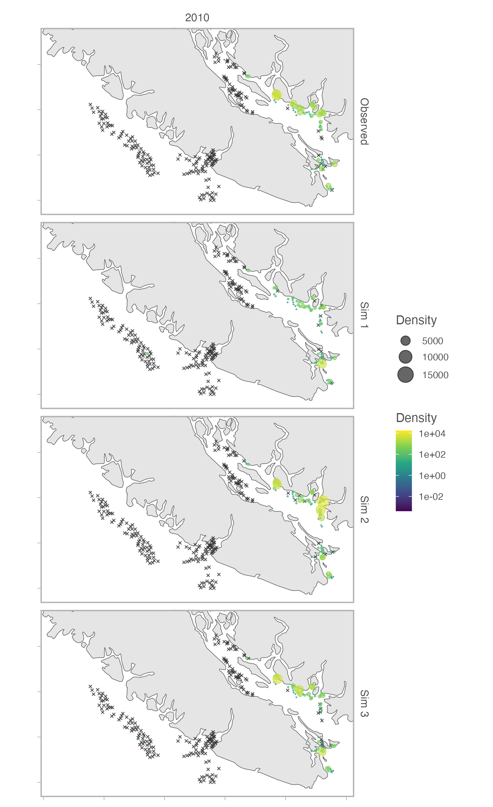

<!-- Build with: xaringan::inf_mr() -->

```{r preamble, include=FALSE, cache=FALSE}
source(here::here("dfo-tesa-2025/preamble.R"))
do.call(knitr::opts_chunk$set, knitr_opts)
```

```{r libs, include=FALSE}
library(dplyr)
library(sdmTMB)
library(ggplot2)
```

# Useful things to do with sdmTMB simulation

- Survey design

- Evaluation model distributional assumptions

- Evaluating the ability to estimate quantities / model bias

- To understand how a model behaves

---

# Decisions when simulating from a fitted model

Fixed effects: fixed (MLE), MVN draw, MCMC draw

Random effects: 

- empirical Bayes (EB) estimates, MVN draw, MCMC draw *from the precision matrix*

- draw from a new random field based on the estimated "hyper" parameters (e.g. SD and range)

---

# Do I want to draw from the precision matrix?

.small[
Do I want my spatial "wiggles" to reflect my fitted system?
 - If yes: draw from the precision matrix
]

--

.small[
Do I want entirely new "wiggles" that just have the same properties (same variance and same rate of correlation decay)?
 - If yes: simulate new GMRFs
 ]
 
--

.small[
Do I want to ensure I have simulated data that can be recovered without any bias in ideal conditions?
 - If yes: simulate new GMRFs
]

---

# `simulate.sdmTMB()` vs. `sdmTMB_simulate()` !?

`simulate.sdmTMB()`: simulate from an already fitted model

`sdmTMB_simulate()`: simulate data from scratch; may be renamed `simulate_new()`.

The lines blur: you can take estimates from a fitted model and feed them to `sdmTMB_simulate()`.

---

class: center, middle, inverse

# Examples

---

# Examples

`simulate.sdmTMB()` by default only simulates new observation error and 1 draw:

```{r, eval=FALSE, echo=TRUE}
simulate(fit)
simulate(fit, nsim = 100)
```

---

# Examples

Simulating with entirely new random effects based on the estimated SDs and ranges:

```{r, eval=FALSE, echo=TRUE}
simulate(fit, re_form = NA)
```

---

# Examples

Simulating with a new draw of random effects for each iteration:

```{r, eval=FALSE, echo=TRUE}
simulate(
  fit, 
  type = "mle-mvn", #<<
  mle_mvn_samples = "multiple", #<<
  nsim = 100
)
```

---

# Examples

Simulating from a fitted model and refitting to it

```{r, eval=FALSE, echo=TRUE}
fit <- sdmTMB(y ~ 1, ..., data = dat)

dat$y_sim <- simulate(fit, type = "mle-mvn") #<<

fit2 <- sdmTMB(y_sim ~ 1, ..., data = dat)
```

---

# Examples

Simulating new random fields based on the estimated field properties

```{r, eval=FALSE, echo=TRUE}
fit <- sdmTMB(...)

dat$y_sim <- simulate(fit, re_form = NA) #<<

fit2 <- sdmTMB(y_sim ~ 1, ..., data = dat)

# repeat in a loop and assess bias in parameters etc.
```

---

# Examples

.xsmall[
Simulate from a fitted model to assess whether your model is probabilistically consistent with the observations.
]

```{r}
fit <- sdmTMB(density ~ 1, data = pcod_2011, spatial = "off", family = tweedie())
obs_prop_zero <- mean(pcod_2011$density == 0)
```

.small[
```{r, echo=TRUE, out.width="60%"}
s <- simulate(fit, nsim = 100) #<<
prop_zeros <- apply(s, 2, \(x) mean(x == 0))
hist(prop_zeros)
abline(v = obs_prop_zero, col = "red", lwd = 2)
```
]

---

# Examples

Use `newdata` in `sdmTMB.simulate()` to simulate new observations. E.g., to compare survey designs.

```{r, eval=FALSE, echo=TRUE}
fit <- sdmTMB(...)

# new = new survey locations
new$y_sim <- simulate(fit, newdata = new, ...)

fit_sim <- sdmTMB(y_sim ~ ..., data = new)

p <- predict(fit_sim, ...)

get_index(p)1

# compare against known truth
# (simulate on your survey grid) and repeat
```


---

# Examples

Feeding in random effects from a fitted model to `sdmTMB_simulate()`.

```{r, eval=FALSE, echo=TRUE}
fit <- sdmTMB(...)
omega <- get_pars(fit)$omega_s
sdmTMB_simulate(
  ~ depth, 
  data = data, 
  fixed_re = list(omega_s = omega) #<<
)
```

---

# Examples

.xsmall[
Check simulations conditioned on a model as a graphical "Turing test". Can you, or a colleague, or a reviewer distinguish which panel is real?
]

.center[

]
