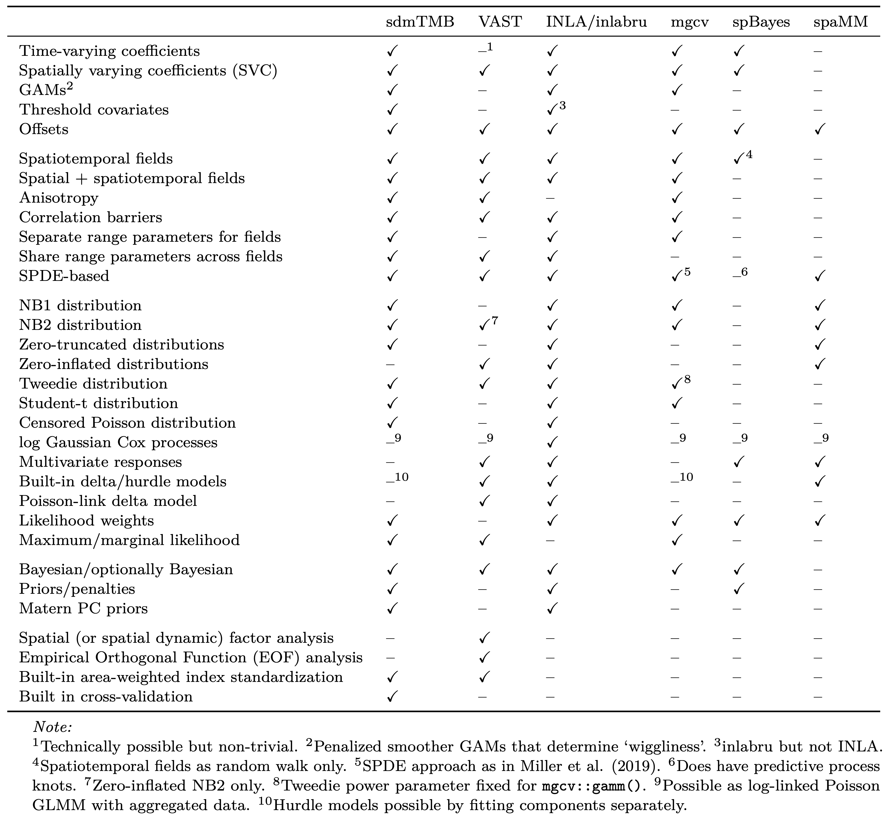

<!-- Build with: xaringan::inf_mr() -->

```{r preamble, include=FALSE, cache=FALSE}
source(here::here("dfo-tesa-2025/preamble.R"))
do.call(knitr::opts_chunk$set, knitr_opts)
```

```{r libs, include=FALSE}
library(sdmTMB)
```

# Getting help

* sdmTMB GitHub repository:  
  <https://github.com/pbs-assess/sdmTMB>
  
* sdmTMB documentation:  
  <https://pbs-assess.github.io/sdmTMB/index.html>

*  New features to suggest? Bugs?  
  <https://github.com/pbs-assess/sdmTMB/issues>
  
*  Resources and reference material: 
  <https://github.com/pbs-assess/sdmTMB/wiki/resources>

---

class: center, middle, inverse

# Troubleshooting

---

# Example of non-converging model

.small[
```{r pcod-spatial-rf, echo=TRUE, eval=TRUE, warning=FALSE}
mesh <- make_mesh(pcod, xy_cols = c("X", "Y"), cutoff = 10)

fit <- sdmTMB(
  present ~ depth * year,
  data = pcod,
  mesh = mesh,
  family = binomial(link = "logit"),
  spatial = "on"
)
```

```r
#> Warning message:
#> The model may not have converged: 
#> non-positive-definite Hessian matrix. 
```
]
---

# Who is Hessian and why are they not "positive definite"?

* A Hessian matrix is a matrix of second derivatives of a function (here the log likelihood surface)

--

* The inverse of the negative Hessian is the parameter covariance matrix

--

* Warning means the curvature of the log-likelihood surface is inconsistent with the model having found the best fit

--

* Overparameterized? Variance estimated near zero?

--

* See [vignette("troubleshooting", "glmmTMB")](https://cran.r-project.org/web/packages/glmmTMB/vignettes/troubleshooting.html)

---

# Inspecting output

One or more standard errors being `NaN` is a problem:

.xsmall[
```{r, echo=TRUE}
print(fit)
```
]

---

# Sanity

```{r checksanity, eval=TRUE, echo=TRUE, message=TRUE}
sanity(fit)
```


---

# Inspecting output

We could also look directly at output from TMB `TMB::sdreport()`:

.small[
```{r, echo=TRUE}
fit$sd_report
```
]

---

# Looking at gradients

Log likelihood gradient with respect to fixed effects:

.small[
```{r, echo=TRUE}
max(fit$gradients)
```
]

* Gradient becomes smaller as the log likelihood surface becomes flatter at the location in parameter space

--

* Flatter surface = closer to point of maximum likelihood

--

* So, small values are consistent with convergence (no hard rule, perhaps at least < 0.001)

---

# Interpretation

* Linear interaction term seems tricky to estimate

* Solutions:
  * make sure the model is identifiable! e.g., try `glm()` and think about it
  * drop linear interaction (maybe not important)
  * try re-scaling predictors
  * try a different mesh setup
  * simplify some other part of the model
  * try a related fixed-effect structure, e.g., non-linear smooths
  * try priors
  
---

# How do we fit smooth effects by year?

For example, separate smooths by year:

```{r eval = FALSE, echo=TRUE}
pcod$fyear <- as.factor(pcod$year)
fit <- sdmTMB(
  present ~ s(depth, by = fyear), #<<
  data = pcod,
  mesh = mesh,
  family = binomial(link = "logit"),
  spatial = "on"
)
```

---

# Can we use these models with fisheries dependent data?

- Theoretically no, in practice, yes. See "preferential sampling" literature

--

- Several papers show these can work very well for commercial CPUE and better than alternatives

--

- Theoretically, if all covariates driving the preferential sampling (e.g., depth, location) the sampling bias problem is ameliorated

--

- If worried, simulate it, or attempt to account for the preferential sampling.

---

# Things to be aware of when using environmental covariates

- Same principles apply with sdmTMB as any GLM/GLMM/GAM

--

- Ideally, use the same source for observations and grid, especially if or index standardization

--

- Covariates and random fields can compete to explain the same variance; can be seen a feature or a bug

--

- Don't be surprised if the fields explain a lot more variance than your fixed effects!

---

# Can sdmTMB be used with tracking data?

- Only sort of

--

- Not while taking advantage of all the information in the data

--

- If tracking data is reduced, yes

---

# Help me wrap my head around why we need the mesh and SPDE again

- Two things going on speed-wise: mesh and SPDE

--

- Mesh lets us work with (far) fewer random effects

--

- Mesh also gives us the matrices we need to do the SPDE math

--

- SPDE lets us work with the precision matrix instead of covariance matrix; avoids matrix inversion, much faster

--

- RTMB examples: [direct MVN Gaussian random field](https://github.com/seananderson/RTMB-TESA-spatial/blob/main/exercises/01-spatial-dmvnorm.R), [SPDE GMRF](https://github.com/seananderson/RTMB-TESA-spatial/blob/main/exercises/02-spatial-spde.R)

---

# What are common problems when starting out?

- Analysis paralysis with all the options

--

- Using (or starting with) too fine of a mesh

--

- Designing a mesh that doesn't cover your whole prediction area

--

- SDs that collapse to zero + poorly estimated range parameters

--

- Using different environmental data when fitting and predicting

---

# Common problems continued

- Not converting the prediction grid and data into the same projection

--

- Missing covariates in the prediction grid

--

- Using a prediction grid that does not overlap your observations by mistake

---

# Related modelling software

.center[

]

---

# When should I use VAST, sdmTMB, or tinyVAST?

- `¯\_(ツ)_/¯`

--

- Timeline: SpatialDeltaGLMM, VAST, sdmTMB, tinyVAST

--

- Current actively developped packages: sdmTMB and tinyVAST

--

- If set up the same, VAST, sdmTMB, and tinyVAST can all fit *identical* models and have been extensively tested

---

## sdmTMB vs. tinyVAST (in my opinion!)

.small[
- Neither going anywhere soon; Jim and I work on both
]

--

.small[
- sdmTMB more user friendly, focusses on univariate responses
]

--

.small[
- sdmTMB has the most built-up set of functions for summarizing, checking, and working with the output
]

--

.small[
- sdmTMB can only fit "multivariate" responses if the fields are independent across categories
]
--

.small[
- tinyVAST focusses on multivariate responses but (of course) also does univariate responses
]

--

.small[
- Compared to VAST: adds structural equation and dynamic structural equation modelling
]

---

### Is there likely a need for High Performance Computing with sdmTMB?

- sdmTMB can do multicore likelihood calculations<br>`TMB::openmp(n=3, DLL="sdmTMB")`

--

- But it's not always faster!

--

- Memory can be an issue with larger datasets, and especially many (correlated) random effects (i.e., large meshes, AR1/random walks)

--

- For index standardization memory issues: <br>`?get_index_split`

--

- If fitting lots of models, absolutely!

---

# Is there anything computationally I can do to speed up my models?

Yes! Especially for correlated random fields with large meshes.

See the "OpenBLAS" installation instructions on the main sdmTMB README.md page:

<https://github.com/pbs-assess/sdmTMB>

---

# Words of wisdom

**Start simple!**

--

These are complex models:

--

* May take a while to fit (`silent = FALSE`)

--

* Easy to create configurations that won't converge

--

* Can also be hard to wrap your head around

---

# Words of wisdom

--

Options for starting simple:

--

* Start intercept only

--

* Start with a spatial not spatiotemporal model

--

* Start without random fields:  
  `spatial = 'off', spatiotemporal = 'off'`
  
--

* Start with coarse meshes, maybe increase later  
  .xsmall[Mesh resolution greatly impacts speed and finer is not always better; can affect convergence.]

---

# More words of wisdom

--

* Make lots of plots  
  .xsmall[Plot the raw data, plot the predictions, plot the random fields, ...]

--

* Don't get too caught up in model configuration  
  .xsmall[Many are only subtly different and can produce similar predictions]

--

* Consider the scale of the response and predictors
  .xsmall[Keep parameters not too big or small]

--

* Consider if observation error variance >> process variance   
  .xsmall[Known to be problematic for state-space models]
  
